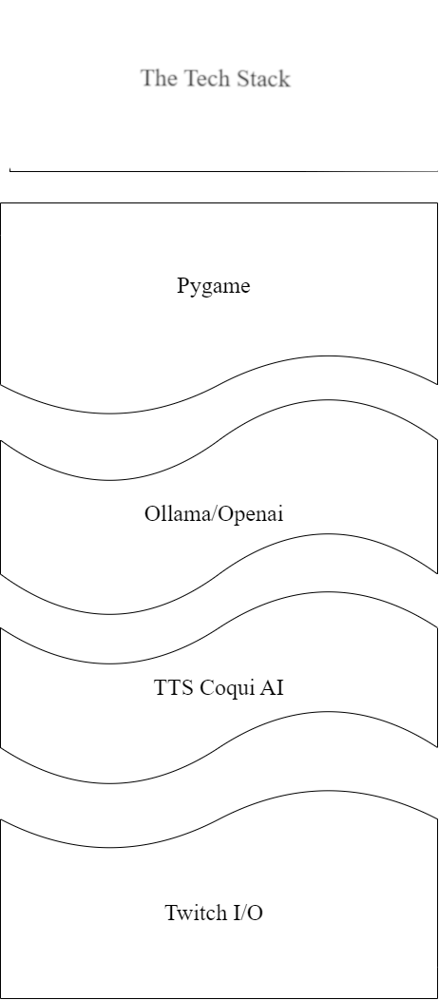

# AssistMe - Your Desktop Friend

AssistMe is an AI-powered desktop and Twitch streaming assistant that brings your pictures to life. Whether you're building a Jarvis or want a picture of your mom to judge everything you do on your desktop, AssistMe makes it possible.

**Please note:** This program is currently in the development phase.

## Features

- **OpenAI-powered or Ollam-powered chatbot:** Engage in interactive conversations with your AI assistant.

- **Function calling:** Enable function calling for both chatbot and user.

- **Pygame integration:** Display and animate character art that moves to the audio it plays. Make the avatar reactive to what is going on.

- **Text-to-Speech (TTS):** Play sound and animations on art. Get text from a LLM to create the voice of your ai Avatar.

- **Customizable art:** Bring your own art to the platform. Make an avatar out of any picture.

- **Twitch integration:** Connect your Twitch account for an enhanced streaming experience.

- **Screenshot and image recognition:** Capture and recognize images on your screen. Your assistant can see what you do. Customizable image frequency. 

- **Memory storage/context-window solution:** Store and retrieve context from your interactions with the AI. Improved LLM Memory that only takes into account relevant information as well as a small portion of the conversation so far. 

- **Interactive Twitch game:** Maybe a chat vs AI battle mode? (Under consideration)

We're always open to new ideas. If you have any suggestions or feature requests, feel free to let us know.

## Requirements

- Python 3.10
- Windows OS (Support for other operating systems is under consideration)
- Python Requirements
    `pip install torch`

    `pip install TTS`

    `pip install Ollama`

    `pip install Openai`

    `pip install pygame`

    `pip install pygame-menu`

    `pip install python-dotenv`

    

## Getting Started

(Here you can add instructions on how to install and use your application)

## Contributing

(If you're open to contributions, you can add instructions on how to contribute to your project here)

## License

(If your project is open source, you can specify the license under which it's available here)

## Project Status

Please note that this project is developed for fun and personal learning purposes. It may be subject to changes or discontinuation based on my interests and learning progress.

Feel free to contribute or fork the project if you find it interesting!
